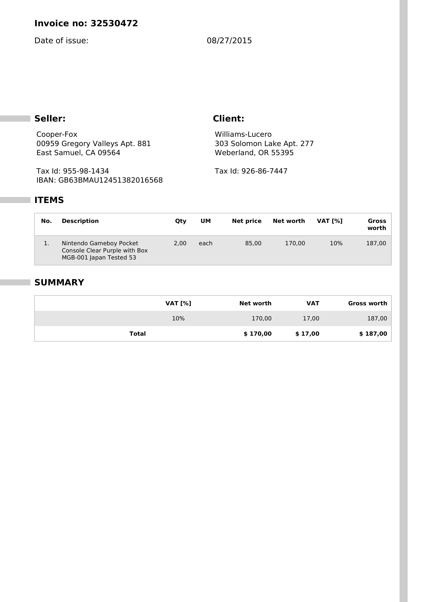
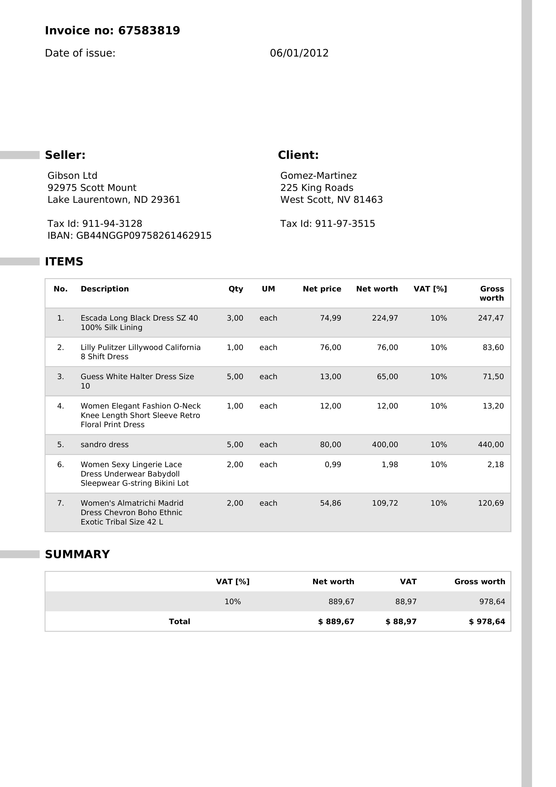
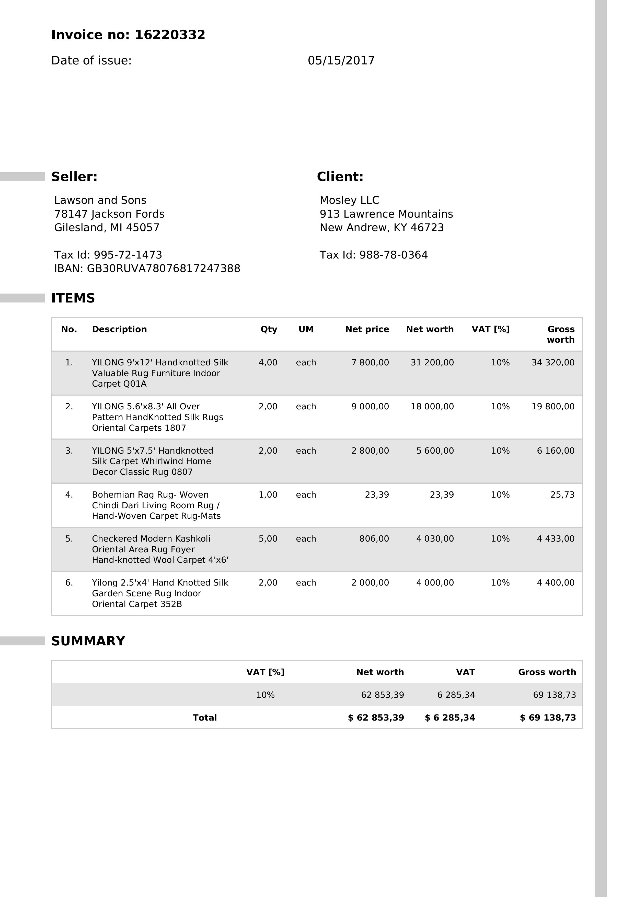
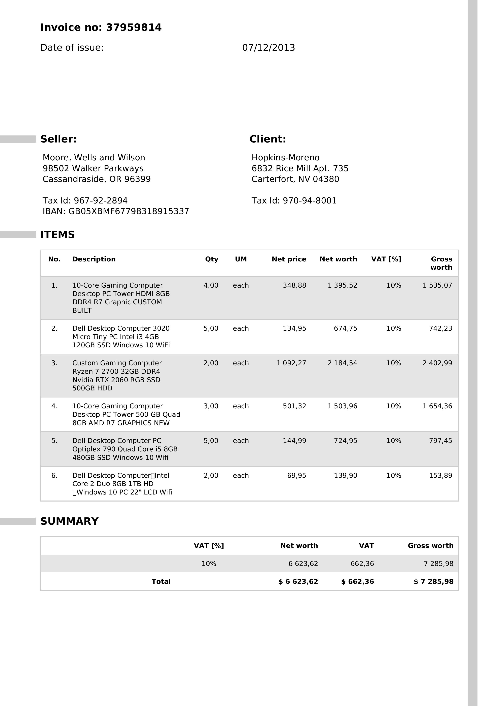
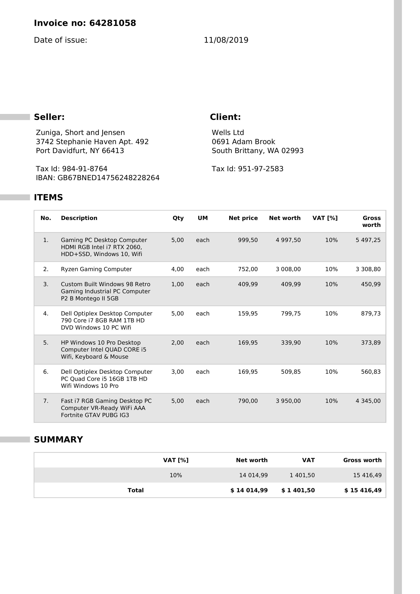

# Результаты Обучения (2026-04-17)

## Текущая Модель

`Bennet1996/donut-small`

Текущий дообученный чекпоинт сохранён локально здесь:

- `E:\thesis\outputs\Bennet1996_donut-small_ft_best`

## Стало Ли Лучше?

Да.

Предыдущий хороший локальный прогон:

- train samples: `199`
- val samples: `49`
- epochs: `5`
- best val loss: `1.2529`

Улучшенный прогон:

- train samples: `424`
- val samples: `49`
- epochs: `8`
- max length: `256`
- gradient accumulation steps: `4`
- learning rate: `1.5e-5`
- best val loss: `0.7833`

Итог: `val loss` улучшился с `1.2529` до `0.7833`.

## Конфигурация Улучшенного Обучения

- Датасет: `katanaml-org/invoices-donut-data-v1`
- Модель: `Bennet1996/donut-small`
- Устройство: `NVIDIA GeForce RTX 3080`
- CUDA: включена
- Размер изображения: `640x480`
- Максимальная длина target: `256`
- Scheduler: `cosine`
- Warmup ratio: `0.08`
- Weight decay: `0.01`
- Gradient clipping: `1.0`
- Early stopping: поддерживается в коде

## Метрики По Эпохам

| Эпоха | Train Loss | Val Loss |
|---|---:|---:|
| 1 | 6.8848 | 3.6028 |
| 2 | 3.1864 | 2.2377 |
| 3 | 1.5537 | 1.2654 |
| 4 | 1.0692 | 0.9869 |
| 5 | 0.8178 | 0.8566 |
| 6 | 0.6814 | 0.8004 |
| 7 | 0.6246 | 0.7852 |
| 8 | 0.6102 | 0.7833 |

## Лучший Результат

- Лучший validation loss: `0.7832700318219711`
- Лучшая эпоха: `8`

## Примечания По Датасету

- Использовано train-примеров: `424`
- Использовано validation-примеров: `49`
- Пропущено при подготовке:
  - `1` train-пример
  - `1` validation-пример
- Причина: после сериализации `ground_truth` оказался пустым

## Сравнение Base vs Fine-Tuned

Были проведены два типа сравнения:

- быстрый качественный анализ на `5` validation-примерах;
- полная field-level оценка на всей validation-выборке (`49` валидных документов).

Base model:

- `Bennet1996/donut-small`

Fine-tuned model:

- `E:\thesis\outputs\Bennet1996_donut-small_ft_best`

### Краткий Вывод

- Полная проверка на validation подтверждает, что дообученная модель сильно лучше базовой.
- Базовая модель фактически не восстанавливала нужную invoice-структуру.
- Дообученная модель уверенно восстанавливает ключевые поля.

### Результаты На Всей Validation-Выборке

Оценено документов: `49`

Document-level exact match:

- base model: `0.0000`
- fine-tuned model: `0.0000`

Field-level exact-match accuracy:

| Поле | Base | Fine-tuned |
|---|---:|---:|
| `invoice_no` | 0.0000 | 1.0000 |
| `invoice_date` | 0.0000 | 1.0000 |
| `seller` | 0.0000 | 0.0000 |
| `client` | 0.0000 | 0.0000 |
| `seller_tax_id` | 0.0000 | 0.9592 |
| `client_tax_id` | 0.0000 | 1.0000 |
| `iban` | 0.0000 | 0.3878 |
| `total_net_worth` | 0.0000 | 0.9184 |
| `total_vat` | 0.0000 | 0.9184 |
| `total_gross_worth` | 0.0000 | 0.8571 |

Интерпретация:

- по всем важным структурным полям fine-tuned модель лучше;
- `invoice_no` и `invoice_date` на этой validation-выборке идеальны;
- tax ID почти идеальны;
- суммы предсказываются очень хорошо;
- `seller` и `client` как длинный свободный текст пока слабые при строгом exact match;
- `IBAN` заметно улучшился, но ещё нестабилен.

### Quick Qualitative Comparison

- Полное совпадение всей строки на этих 5 примерах:
  - base model: `0 / 5`
  - fine-tuned model: `0 / 5`
- Но качественно fine-tuned модель намного лучше.
- Base model часто генерирует нерелевантную структуру и посторонние поля.
- Fine-tuned модель уже предсказывает правильный invoice-формат, нужные идентификаторы и близкие к истине суммы, хотя пока иногда дублирует закрывающие теги и слегка искажает адреса или суммы.

### Пример 1

- Dataset index: `41`
- Ground truth ключевые поля:
  - invoice_no: `32530472`
  - invoice_date: `08/27/2015`
  - gross: `$ 187,00`
- Base model:
  - сгенерировала нерелевантные поля вроде `StraГџe`, `Geburtsdatum`, `Gesamtbrutto`
- Fine-tuned model:
  - правильно восстановила `invoice_no = 32530472`
  - правильно восстановила `invoice_date = 08/27/2015`
  - правильно или почти правильно восстановила итоговую сумму `$ 187,00`
  - всё ещё искажает seller/client текст и дублирует хвостовые теги

### Пример 2

- Dataset index: `7`
- Ground truth ключевые поля:
  - invoice_no: `67583819`
  - invoice_date: `06/01/2012`
  - net: `$ 889,67`
  - gross: `978,64`
- Base model:
  - выдала нерелевантный текст и неверную структуру
- Fine-tuned model:
  - правильно восстановила `invoice_no = 67583819`
  - правильно восстановила `invoice_date = 06/01/2012`
  - правильно восстановила `seller_tax_id = 911-94-3128`
  - правильно восстановила `client_tax_id = 911-97-3515`
  - итоговая сумма получилась близкой, но не идеально точной

### Пример 3

- Dataset index: `1`
- Ground truth ключевые поля:
  - invoice_no: `16220332`
  - invoice_date: `05/15/2017`
  - gross: `$ 69138,73`
- Base model:
  - вывела в основном нерелевантную и структурно неверную последовательность
- Fine-tuned model:
  - правильно восстановила номер и дату
  - правильно восстановила tax IDs
  - правильно восстановила `IBAN`
  - итоговая сумма очень близка к правильной
  - в конце всё ещё появляется лишний дублирующий текст

### Пример 4

- Dataset index: `48`
- Ground truth ключевые поля:
  - invoice_no: `37959814`
  - invoice_date: `07/12/2013`
  - net: `$6623,62`
  - gross: `$7285,98`
- Base model:
  - практически развалилась в повторяющийся нерабочий текст
- Fine-tuned model:
  - правильно восстановила номер и дату
  - правильно восстановила seller/client tax IDs
  - правильно восстановила `IBAN`
  - правильно восстановила gross total
  - ошиблась в VAT и оставила повторяющийся хвост

### Пример 5

- Dataset index: `17`
- Ground truth ключевые поля:
  - invoice_no: `64281058`
  - invoice_date: `11/08/2019`
  - net: `$ 14 014,99`
  - gross: `$ 15 416,49`
- Base model:
  - выдала в основном нерелевантный шаблонный текст
- Fine-tuned model:
  - правильно восстановила номер и дату
  - правильно восстановила оба tax ID
  - правильно восстановила `IBAN`
  - gross amount получился очень близким
  - всё ещё заметен структурный хвост

## Практический Вывод

Дообученная модель уже заметно полезнее, чем out-of-the-box версия для invoice-задачи.

Главные улучшения:

- модель научилась ожидаемой invoice-структуре;
- теперь она предсказывает task-relevant поля вместо нерелевантного текста;
- ключевые идентификаторы и суммы часто правильные.

Главные оставшиеся проблемы:

- дублирующиеся закрывающие теги;
- периодическое искажение адресов;
- иногда есть небольшие ошибки в суммах или VAT;
- `IBAN` ещё требует улучшения.

## Следующий Полезный Шаг

Самый полезный следующий шаг — улучшать модель под слабые поля:

- `seller`
- `client`
- `iban`

Практически это можно делать через:

- более строгую постобработку вывода;
- дополнительное дообучение;
- отдельную field-level нормализацию для длинных адресов и IBAN.
